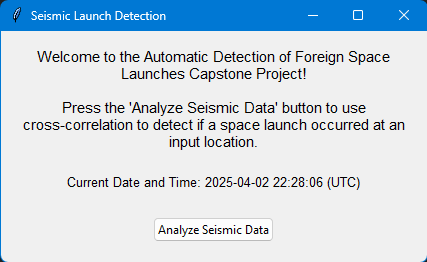
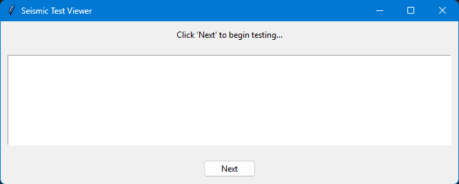

# ADOFSL5911 - Automatic Detection of Foreign Space Launches

**Authors**: Ian Claggett, Luke Rako, Klay Shukla, Divyang Prajapati, John Paul Beli

## Project Abstract

ADOFSL5911 is a seismic data analysis system designed to automatically detect foreign space launches by comparing live seismic data to known rocket launch templates using cross-correlation techniques and machine learning. The system collects waveform data from seismic stations like CI BUE, CI LOC, and NZ BKZ to match against historical templates and identify potential launch events.

## Project Structure

```
ADOFSL5911
├── Template_Traces       # Stored seismic templates from known launches
├── Cartopy.py            # Map visualization of seismic events
├── correlation_testing.py# GUI for running cross-correlation tests
├── Correlator.py         # Core cross-correlation logic
├── main.py               # Main script for automated launch detection
├── RealTime.py           # Continuous real-time detection
├── SeismicStations.py    # Manage seismic station data
├── stations.txt          # Text file with seismic station info
├── template_loader.py    # Generates and saves new waveform templates
├── test.py               # Basic ObsPy installation test
└── README.md             # Project documentation
```
## Dependencies

- ObsPy
- NumPy, SciPy
- Matplotlib
- Cartopy
- Tkinter

## Installation

Install required libraries:

```bash
pip install numpy scipy matplotlib lxml sqlalchemy pyreadline ipython obspy
```

For Windows help, see [ObsPy Installation Guide](<https://github.com/obspy/obspy/wiki/Installation-on-windows-using-a-pre-build-package-(pypi)>).

## Getting Started

### 1. Load Templates

Generate and store waveform templates:

```bash
python template_loader.py
```

### 2. Run Cross-Correlation Tests

Launch the GUI tester:

```bash
python correlation_testing.py
```

Use the "Next" button to go through templates one-by-one.

### 3. Real-Time Monitoring

Start real-time detection:

```bash
python RealTime.py
```

### 4. Visualization

Plot seismic stations and events on a map:

```bash
python Cartopy.py
```

### 5. Station Management

Add, remove, or view stations:

```bash
python SeismicStations.py
```

## Running the Code

Run the main script:

```bash
python main.py
```

### Step-by-Step GUI

Step 1: Analyze Seismic Data



Step 2: Begin Testing



Note: You must close each plot before the next test begins.

## Adding and Testing a New Launch Template

### 1. Identify Launch Details

Pick a launch time and station:

- Launch time: `2025-04-01T10:30:00`
- Network: `CI`, Station: `LOC`, Channels: `BHZ,BLZ`

### 2. Generate the Template

Add this to `template_loader.py`:

```python
#New Launch - Example
try:
    launchTime = UTCDateTime("2025-04-01T10:30:00")
    startTime = launchTime - 60
    endTime = launchTime + 210
    template = client.get_waveforms("CI", "LOC", "*", "BHZ,BLZ", startTime, endTime, attach_response=True)
    template.remove_response(output="VEL")
    template.filter('bandpass', freqmin=0.25, freqmax=1.5)
    pick = UTCDateTime("2025-04-01T10:30:30")
    template.trim(pick, pick + 90)
    template.write(TEMPLATE_FILE_PATH + "/01-04-2025_CI_LOC_NewRocket", format="MSEED")
    print("Saved template: 01-04-2025_CI_LOC_NewRocket")
except Exception as e:
    print(f"Failed to generate 01-04-2025_CI_LOC_NewRocket: {e}")
```

Run it:

```bash
python template_loader.py
```

### 3. Add to the Test Suite

In `correlation_testing.py`:

```python
ci_loc_templates = collect_templates([
    "Template_Traces/24-11-2024_CI_LOC_Rocket",
    "Template_Traces/15-03-2025_CI_LOC_SpaceX",
    "Template_Traces/11-03-2025_CI_LOC_SpaceX",
    "Template_Traces/01-04-2025_CI_LOC_NewRocket"
])
```

And add the launch time:

```python
launch_events = [
    ...,
    ("2025-04-01T10:30:00", 60, 240)
]
```

### 4. Run Tests

```bash
python correlation_testing.py
```

## Logger

We use Python’s built-in logging module to track errors and events across scripts. Logs are stored in a rotating log file inside a logs/ directory. This makes it easier to debug without cluttering the terminal or GUI.

- Log file path: logs/system.log
- Each run appends new messages while keeping the file size in check.
- Console messages (e.g., print()) are redirected to the GUI in correlation_testing.py.

Note: Make sure the logs/system.log file is excluded from commits. Add the following to your .gitignore:

`logs/system.log`

This ensures each developer has a local log file without pushing it to the repository.

## How Cross-Correlation Works

- Load templates from known launches.
- Fetch waveform data for new time range.
- Preprocess and filter waveforms.
- Compare similarity to known templates.
- Show results and plots in GUI.

## Output

- Waveform visualizations.
- Similarity scores for detections.
- Console output appears inside the GUI.

## Example: Test ObsPy Setup - test.py

```python
from obspy import read
st = read()
st.filter(type='highpass', freq=3.0)
st = st.select(component='Z')
st.plot()
```

## Troubleshooting

- Make sure templates exist in `Template_Traces`
- Check `stations.txt` for valid station IDs
- GUI must support Matplotlib plots

---

For help, contact the project maintainers.
